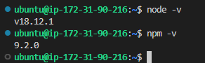
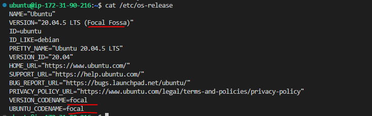
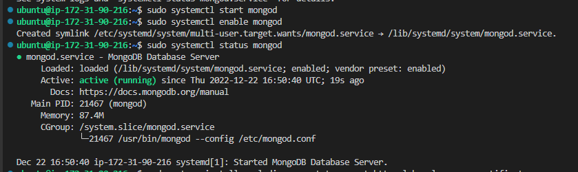
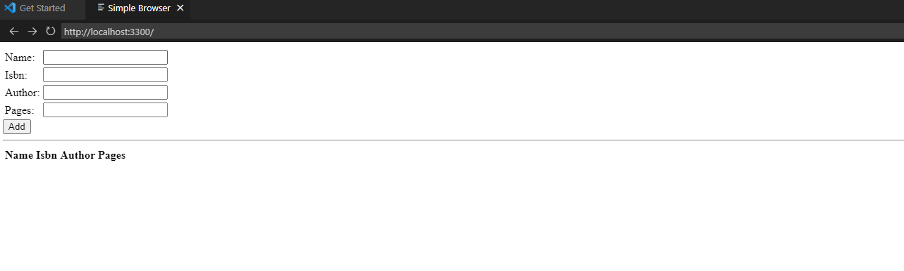
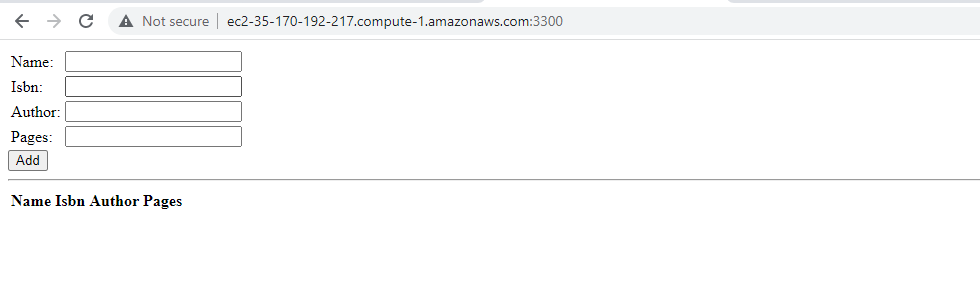
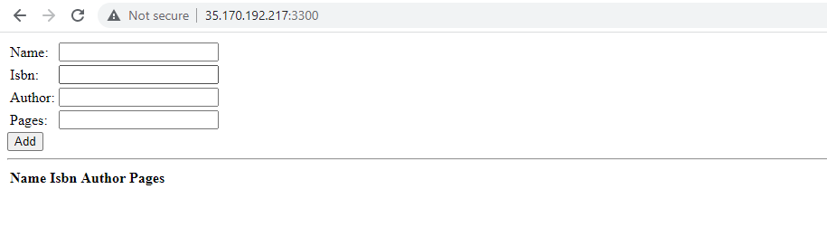
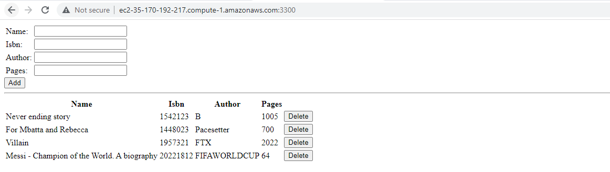

# MEAN STACK DEPLOYMENT TO UBUNTU IN AWS
MEAN Stack is a combination of MongoDB, Express, Angular and Node.js

Our project today makes use of all of them and will be demonstrated below.

To get started we provision an AWS Ubuntu server. This has been treated in previous projects. 

 Please check [here](https://github.com/ibkdizzu/DevIntProjs/tree/main/LAMP%20STACK)  if you need guidance to spin up a server and connect to it.

## STEP 1 - Install NodeJS

To start every project, it is recommended to always update/upgrade your linux server to recieve latest packages
To do this, run the commands below and follow the prompts

    sudo apt update
    sudo apt upgrade

To install Node.js, we fetch it's location from Ubuntu repositories

    curl -fsSL https://deb.nodesource.com/setup_18.x | sudo -E bash -

Install Node.js with the command below

    sudo apt-get install -y nodejs

Check that node.js is installed with

    node -v
    npm -v

## STEP 2 - Install MongoDB
In the course of this project, I found the installation of MongoDB a little more challenging than expected. The most important bit of imformation I can give is to ensure the version of your ubuntu server matches the repository you are pulling your package. 

Find your ubuntu version with the code below
    
    cat /etc/os-release

For this project, I am using "focal" and therefore pulling from repo relevant to the version

- First, Install dependencies

    suoo apt update
    sudo apt install dirmngr gnupg apt-transport-https ca-certificates software-properties-common

- Download and add the MongoDB GPG Key

    wget -qO - https://www.mongodb.org/static/pgp/server-5.0.asc | sudo apt-key add -

- Create a list for MongoDB

    echo "deb [ arch=amd64,arm64 ] https://repo.mongodb.org/apt/ubuntu focal/mongodb-org/5.0 multiverse" | sudo tee /etc/apt/sources.list.d/mongodb-org-5.0.list

- Update the local package database.

    sudo apt-get update

- Install the MongoDB with the command below

    sudo apt-get install -y mongodb-org

- Start the MongoDB service and enable it to start automatically after a system reboot

    systemctl start mongod
    systemctl enable mongod

- Now, check the status of the MongoDB service.

    systemctl status mongod

Next we install bodt-parser which helps to process JSON files passed in requests to the server

    sudo npm install body-parser

Next, create a folder named Books

    mkdir Books && cd Books

Initialize npm project in this directory with the code below

    npm init

Next, create a file server.js with the content below

    vi server.js
    var express = require('express');
    var bodyParser = require('body-parser');
    var app = express();
    app.use(express.static(__dirname + '/public'));
    app.use(bodyParser.json());
    require('./apps/routes')(app);
    app.set('port', 3300);
    app.listen(app.get('port'), function() {
        console.log('Server up: http://localhost:' + app.get('port'));
    });

## Step 3 - Install Express and Set up Routes to the Server

We will use Express to pass book information to and from our MongoDB database.
We also will use Mongoose package which provides a straightforward, schema-based solution to model your application data

    sudo npm install express mongoose

In ‘Books’ folder, create a folder named apps

    mkdir apps && cd apps

Create a file named routes.js

    vi routes.js

Copy and paste the code below into routes.js

    var Book = require('./models/book');
    module.exports = function(app) {
    app.get('/book', function(req, res) {
        Book.find({}, function(err, result) {
        if ( err ) throw err;
        res.json(result);
        });
    }); 
    app.post('/book', function(req, res) {
        var book = new Book( {
        name:req.body.name,
        isbn:req.body.isbn,
        author:req.body.author,
        pages:req.body.pages
        });
        book.save(function(err, result) {
        if ( err ) throw err;
        res.json( {
            message:"Successfully added book",
            book:result
        });
        });
    });
    app.delete("/book/:isbn", function(req, res) {
        Book.findOneAndRemove(req.query, function(err, result) {
        if ( err ) throw err;
        res.json( {
            message: "Successfully deleted the book",
            book: result
        });
        });
    });
    var path = require('path');
    app.get('*', function(req, res) {
        res.sendfile(path.join(__dirname + '/public', 'index.html'));
    });
    };

In the ‘apps’ folder, create a folder named models

    mkdir models && cd models

Create a file named book.js

    vi book.js

Copy and paste the code below into ‘book.js’

    var mongoose = require('mongoose');
    var dbHost = 'mongodb://localhost:27017/test';
    mongoose.connect(dbHost);
    mongoose.connection;
    mongoose.set('debug', true);
    var bookSchema = mongoose.Schema( {
    name: String,
    isbn: {type: String, index: true},
    author: String,
    pages: Number
    });
    var Book = mongoose.model('Book', bookSchema);
    module.exports = mongoose.model('Book', bookSchema);

## Step 4 - Access the routes with AngularJS

In this tutorial, we use AngularJS to connect our web page with Express and perform actions on our book register.

In 'Books' directory, crete a folder named public

    mkdir public && cd public

Add a file named script.js with the content below

    var app = angular.module('myApp', []);
    app.controller('myCtrl', function($scope, $http) {
    $http( {
        method: 'GET',
        url: '/book'
    }).then(function successCallback(response) {
        $scope.books = response.data;
    }, function errorCallback(response) {
        console.log('Error: ' + response);
    });
    $scope.del_book = function(book) {
        $http( {
        method: 'DELETE',
        url: '/book/:isbn',
        params: {'isbn': book.isbn}
        }).then(function successCallback(response) {
        console.log(response);
        }, function errorCallback(response) {
        console.log('Error: ' + response);
        });
    };
    $scope.add_book = function() {
        var body = '{ "name": "' + $scope.Name + 
        '", "isbn": "' + $scope.Isbn +
        '", "author": "' + $scope.Author + 
        '", "pages": "' + $scope.Pages + '" }';
        $http({
        method: 'POST',
        url: '/book',
        data: body
        }).then(function successCallback(response) {
        console.log(response);
        }, function errorCallback(response) {
        console.log('Error: ' + response);
        });
    };
    });
    
In the public folder, create a file named index.html with the content below 

    <!doctype html>
    <html ng-app="myApp" ng-controller="myCtrl">
    <head>
        
        
    </head>
    <body>
        

        <table>
            <tr>
            <td>Name:</td>
            <td><input type="text" ng-model="Name"></td>
            </tr>
            <tr>
            <td>Isbn:</td>
            <td><input type="text" ng-model="Isbn"></td>
            </tr>
            <tr>
            <td>Author:</td>
            <td><input type="text" ng-model="Author"></td>
            </tr>
            <tr>
            <td>Pages:</td>
            <td><input type="number" ng-model="Pages"></td>
            </tr>
        </table>
        <button ng-click="add_book()">Add</button>
        

        

        

        <table>
            <tr>
            <th>Name</th>
            <th>Isbn</th>
            <th>Author</th>
            <th>Pages</th>
    
            </tr>
            <tr ng-repeat="book in books">
            <td>{{book.name}}</td>
            <td>{{book.isbn}}</td>
            <td>{{book.author}}</td>
            <td>{{book.pages}}</td>
    
            <td><input type="button" value="Delete" data-ng-click="del_book(book)"></td>
            </tr>
        </table>
        

    </body>
    </html>

Back in 'Books'directory, stat the server by running the command below

    node server.js

The server is now up and running, we can connect it via port 3300

    curl -s http://localhost:3300

TO access the page from the internet, we need to ensure that port 3300 is allowed on our server.

Do this by editing the inbound rules of your EC2 security group

Now you can access our Book Register web application from the Internet with a browser using a Public IP address or Public DNS name.

This is how your WebBook Register Application will look in the browser

Populate with few data and refresh the page

- If you got this, Congratulations!:congratulations: You made it once again. Go ahead and build that castle :clap:

- If you didn't get this then please trace your steps back through the instructions. Goodluck:exclamation::exclamation:

