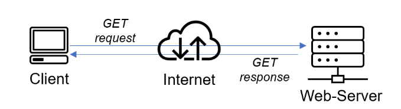
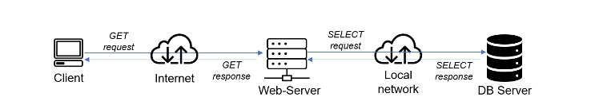
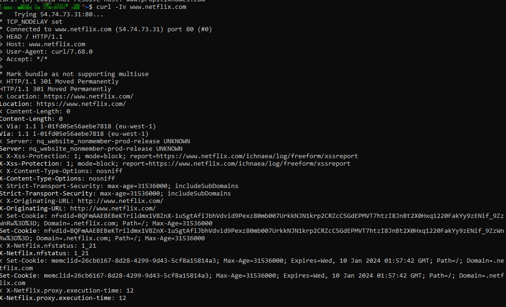
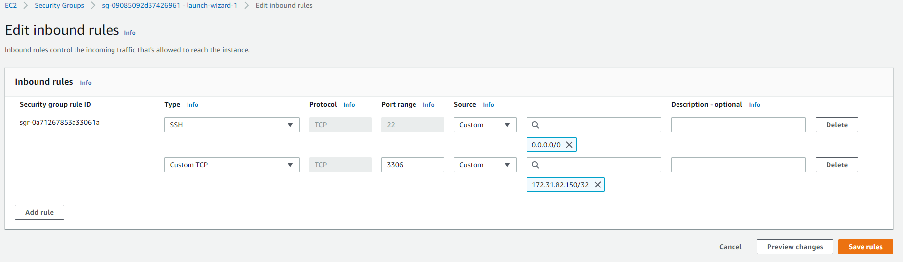
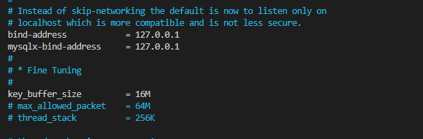
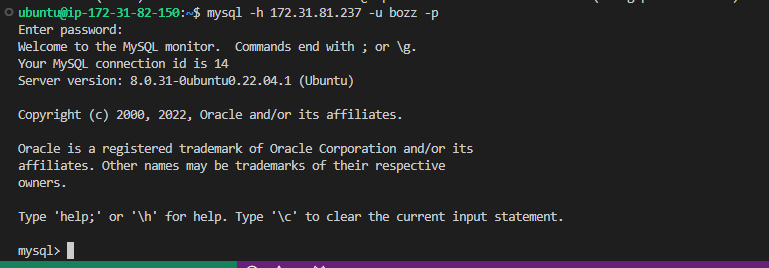
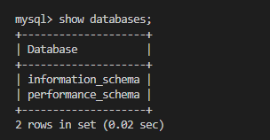

# CLIENT-SERVER ARCHITECTURE WITH MYSQL 

In this project we are exploring the communication channel(s) in a Client-Server architecture

Client : A requester of content or service e.g web browser
Server: Provider of service or a functon to one or many clients e.g Web server

A simple Web Client-Server architecture looks like this

A server can also be a client to other servers. In the image below, the 'Web Server' has a role of a **Client** that connect
read/writes to/from a DB. 

Let’s take a very quick example and see Client-Server communicatation in action.

- Open up your Ubuntu or Windows terminal and run the curl command to any popular website e.g netflix.com:.

    `curl -Iv www.netflix.com`

See the response from the remote server in the below output. You can also see that the requests from the URL are being served by a computer with an IP address **54.74.73.31** on port **80**

In this little example, your terminal will be the client, while www.netflix.com will be the server.

# IMPLEMENT A CLIENT SERVER ARCHITECTURE USING MYSQL DATABASE MANAGEMENT SYSTEM (DBMS).

- Create and configure two Linux-based virtual servers (EC2 instances in AWS).

    - Server A name - "mysql server"
    - Server B name - "mysql client"

- On mysql server Linux Server install MySQL Server software

- On mysql client Linux Server install MySQL Client software.

- Use mysql server's local IP address to connect from mysql client

    Because both EC2 instances are located in the same local virtual network, they can communicate to each other using local IP addresses. Though a few things need to be done to achieve this

    1. Open mysql port 3306 on mysql server. For extra security, allow access only to the specific local IP address of the mysql client

    

    2. Configure MySQL server to allow connections from remote hosts.

        `sudo vi /etc/mysql/mysql.conf.d/mysqld.cnf`

    

    Replace ‘127.0.0.1’ above to ‘0.0.0.0'

- From mysql client Linux Server connect remotely to mysql server Database Engine without using SSH. You must use the mysql utility to perform this action

    To achieve this, create a non root user and grant all privileges

    

    - Use the mysql utility to perform this action.
        `mysql -h server-ip -u username -p`

    

    For clarity:
    - mysql server ip: 172.31.81.127
    - mysql client ip: 172.31.82.150
    
    From our sql client (172.31.82.150), we connected to the database on our mysql server (172.31.81.127) using mysql command
    
- Check that you have successfully connected to a remote MySQL server and can perform SQL queries:

If you see an output similar to the below image, then you have successfully completed this project!  Congratulations!:congratulations: 

If you didn't get this then please trace your steps back through the instructions. Goodluck:exclamation::exclamation:
    

