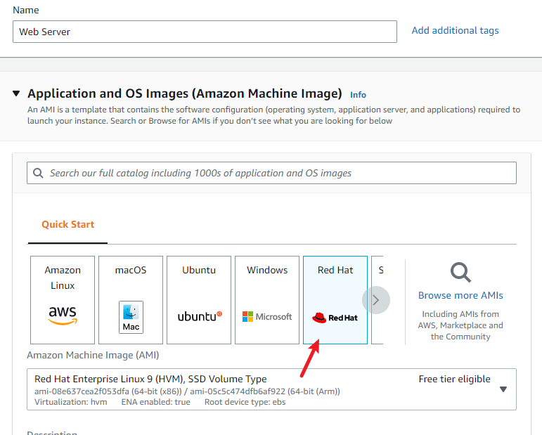
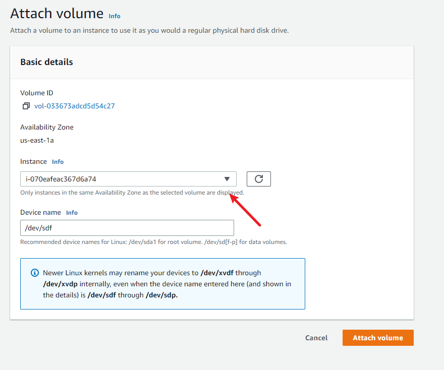
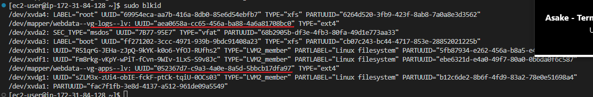
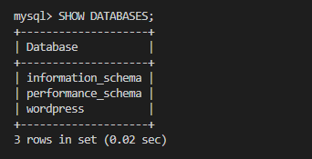

# WEB SOLUTION WITH WORDPRESS

In this project we are tasked with preparing storage infrastructure on two Linux servers and to implement a basic web solution using WordPress.

There are two parts to this project

1. Configure storage subsystem for Web and Database servers based on Linux OS
- We want gain practical experience of working with disks, partitions and volumes in Linux.

2. Install WordPress and connect it to a remote MySQL database server. 
- We want to solidify our skill of deploying Web and DB tiers of Web solution.

# LAUNCH AN EC2 INSTANCE THAT WILL SERVE AS “WEB SERVER”

Launch an EC2 instance that will serve as "Web Server". .



Create 3 volumes in the same AZ as your Web Server EC2, each of 10 GiB


Attach all three volumes one by one to your Web Server EC2 instance




Open up the Linux terminal to begin configuration

Check that the block devices are attached to the server 

   `lsblk`


See all mounts and free space on your server

   
   `df -h`


 create a single partition on each of the 3 disks with dgisk utility 

   `sudo gdisk /dev/xvdf`
   `sudo gdisk /dev/xvdg`
   `sudo gdisk /dev/xvdh`


 View the newly configured partition on each of the 3 disks

   `lsblk`


Install lvm2 package using

   `sudo yum install lvm2`

Run bwloq command to check for available partitions

   `sudo lvmdiskscan`


Next, we want to create physical volumes
Use pvcreate utility to mark each of 3 disks as physical volumes (PVs) to be used by LVM

   `sudo pvcreate /dev/xvdf1`
   `sudo pvcreate /dev/xvdg1`
   `sudo pvcreate /dev/xvdh1`


Use vgcreate utility to add all 3 PVs to a volume group (VG). Name the VG webdata-vg

   `sudo vgcreate webdata-vg /dev/xvdh1 /dev/xvdg1 /dev/xvdf1`

Verify that your VG has been created successfully

   `sudo vgs`


Create 2 logical volumes.
1. apps-lv
2. logs-lv

Half of the physical volume(PV) is allocated to each of the logical volumes (LV)

   `sudo lvcreate -n apps-lv -L 14G webdata-vg`
   `sudo lvcreate -n logs-lv -L 14G webdata-vg`

Verify that your Logical Volume has been created successfully

   `sudo lvs`


Verify the entire setup

   `sudo vgdisplay -v`

This gives a summary view of the Volume group(VG), Physical volume(PV) and Logical volume (V)

   `sudo lsblk`


Format the logical volumes with ext4 filesystem

   `sudo mkfs -t ext4 /dev/webdata-vg/apps-lv`
   `sudo mkfs -t ext4 /dev/webdata-vg/logs-lv`

Create a mount point for the directories

Create /var/www/html directory to store website files

   `sudo mkdir -p /var/www/html`

>**The -p flag helps to create the parent directory if it doesn't already exist. In our case /www did not exist but was created using -p**

Create /home/recovery/logs to store backup of log data

   `sudo mkdir -p /home/recovery/logs`

Mount /var/www/html on apps-lv logical volume

   `sudo mount /dev/webdata-vg/apps-lv /var/www/html/`

>**NB** Mounting wipe out existing data, ensure to confirm the the directory is empty or back up existing files before mounting.

Back up all the files in the log directory /var/log into /home/recovery/logs (**This is required before mounting the file system**)

   `sudo rsync -av /var/log/. /home/recovery/logs/`

Update /etc/fstab file so that the mount configuration will persist after restart of the server

To do this we need the UUID of the devices, we can get the information with 

   `sudo blkid`



sudo vi /etc/fstab


Test the configuration and reload the daemon
 
   `sudo mount -a`

>**NB** If the command above returns no error, then configuration just comleted was correctly doen

   `sudo systemctl daemon-reload`


Verify your setup 

   `df -h`


# Prepare the Database Server
Launch a second RedHat EC2 instance that will have a role – ‘DB Server’
Repeat the same steps as for the Web Server, but instead of apps-lv create db-lv and mount it to /db directory instead of 
/var/www/html/.


# Install WordPress on your Web Server EC2
Update the repository

   `sudo yum -y update`

Install wget, Apache and it’s dependencies

   `sudo yum -y install wget httpd php php-mysqlnd php-fpm php-json`

Start Apache

   `sudo systemctl enable httpd`
   `sudo systemctl start httpd`

To install PHP and its depemdencies

Install the EPEL repository

  `sudo yum install https://dl.fedoraproject.org/pub/epel/epel-release-latest-8.noarch.rpm`

Next import yum utils and enable remirepository
   `http://rpms.remirepo.net/enterprise/remi-release-8.rpm`

Get the list of php versions available for installation

   `sudo yum module list php`

Reset php to install newer version

   `sudo yum module reset php`

To install latest version, in this casr PHP 7.4, enable the module

  `sudo yum module enable php:remi-7.4`

Finally, Install PHP, PHP-FPM(FastCGI Process Manager) and associated PHP modules

  `sudo yum install php php-opcache php-gd php-curl php-mysqlnd`

Start and enable php-fpm
   `sudo systemctl start php-fpm`
   `sudo systemctl enable php-fpm`

Instruct SELinux to allow Apache execute the PHP code via PHP-FPM run

   `setsebool -P httpd_execmem 1`

Restart Apache

   `sudo systemctl restart httpd`

Download wordpress and copy wordpress to var/www/html

   ```
      mkdir wordpress
      cd wordpress
      sudo wget http://wordpress.org/latest.tar.gz
      sudo tar xzvf latest.tar.gz
      sudo rm -rf latest.tar.gz
      cp wordpress/wp-config-sample.php wordpress/wp-config.php
      cp -R wordpress/. /var/www/html/
   ```

Confirm wordpress has beem successfully copied to var/www/html

   `cd /var/www/html`
   `ls`

Step 5 — Configure DB to work with WordPress on DB
SH
Install mysql server
   `sudo yum update`
   `sudo yum install mysql-server`

Restart and enable mysqld
   `sudo systemctl restart mysqld`
   `sudo systemctl enable mysqld`

```
   sudo mysql
   CREATE DATABASE wordpress;
   CREATE USER `root`@`<Web-Server-Private-IP-Address>` IDENTIFIED BY 'password';
   GRANT ALL ON wordpress.* TO 'myuser'@'<Web-Server-Private-IP-Address>';
   FLUSH PRIVILEGES;
   SHOW DATABASES;
   exit
```


>**NB** \Using the IP restricts access to the database to only the IP specified
To connect from *anywhere* use '%' instead of the IP when creating the user
Also GRANT ALL ON wordpress.* restrict the user's access to all tables(*) on wordpress
To grant user access to all tables on all databases use `GRANT ALL ON *.*....` in your command string


Set the bind address

   `sudo vi /etc/my.cnf`


Restart the service

   `sudo systemctl restart mysqld`

On EC2 Server

Edit php config file in /var/www/html with the db details

   `sudo vi wp-config.php`


>**NB** For the hostname *localhost* refers to the host machine but since our database is in the db server, we redirect to the appropriate machine
Also, because both machines are within same subnet, **private ip** is used, otherwise public ip will be required

  `sudo systemctl restart httpd`

Disable default Apache Welocme page

   `sudo mv /etc/httpd/conf.d/welcome.conf  /mv /etc/httpd/conf.d/welcome.conf_backup`

Open MySQL port 3306 on DB Server EC2


Confirm that the webserver can connect to the database

   `sudo mysql -u user -p -h db-server-ip`


   `SHOW DATABASES;`



Configure SELinux Policies

  ```
  sudo chown -R apache:apache /var/www/html/
  sudo chcon -t httpd_sys_rw_content_t /var/www/html -R
  sudo setsebool -P httpd_can_network_connect=1
  sudo setsebool -P httpd_can_network_connect_db 1
  ```
If all goes well to this point, we can access wordpress from our web server url
*ec2-18-233-160-60.compute-1.amazonaws.com*


And we are done!! Wow! It's been quite a journey

From here you can customize wordpress to your need.

- If you got this, Congratulations!:congratulations: You made it once again. Go ahead and build that castle :clap:

- If you didn't get this then please trace your steps back through the instructions. Goodluck:exclamation::exclamation:
