## LAMP WEBSTACK IMPLEMETATION IN AWS
LAMP - stands for Linux, Apache, MySQL, PHP/Python/Perl

Webstacks are a stack of technologies that make different solutions possible. In this implementation, we will be installing these technologies on a cloud server (AWS), and our P is PHP.

The aim of this excercise is a

### Tasks to be completed
1. Provision Ubuntu Server on AWS
2. Remote login to server
3. Install/Configure Apache
4. Install/Configure MySQL
5. Install/Configure PHP
6. Create Virtual host for website using Apache
7. Enable PHP on created website


## Tasks Workthrough
### Provision Ubuntu Server on AWS
**Requirements**
1. AWS account. Sign up for free tier account [here](https://aws.amazon.com/) if you do not already have one
2. Ubuntu EC2 server
3. A keypair. You can use an existing one or create a new one
4. Remote connection via ssh (ubuntu), putty (windows). we'll be connecting with ssh via Vscode in this excercise but your ubuntu, wsl, windows etc will also suffice


- To start login to your AWS account, select EC2 on the navigation menu and under Instance select Launch Instances
- Fill the the installation details like Server name, select OS - we will be working with Ubuntu Server 22.04 LTS for this project

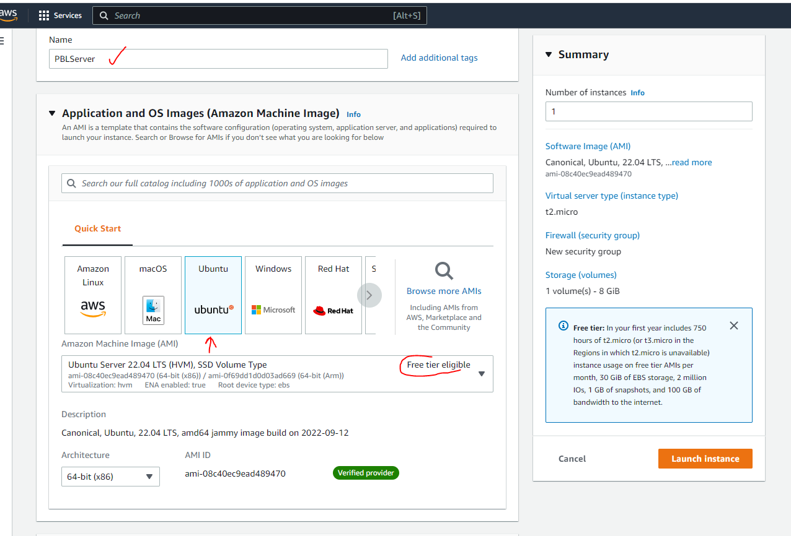

- Select or create a new key pair. This will later be used to establish remote access


- For the purpose of this project, it will suffice to allow all other options use default values

- Click on Launch Instance to complete installation

- Voila! If all steps are followed correctly a new server just gpt provisioned. Go to EC2 dashboard to access new created server

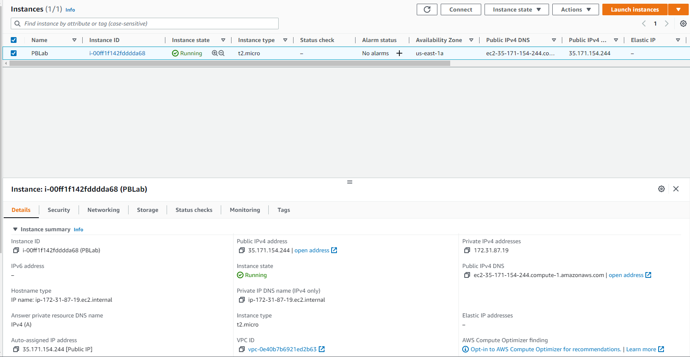

- One more step that can be taken here is open TCP port 80 to receive traffic. To do this go to security tab under the server, select the security group, then edit inbound rules and add http rule as show below and save

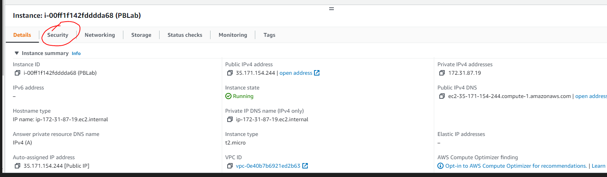

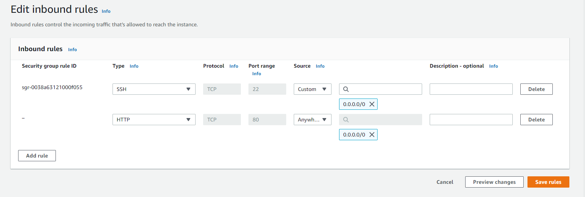


### Remote login to server
**Requirements**
1. Provisioned server
2. Account with sudo access
3. keypair

- If the keypair is newly created, the permission needs to be changed otherwise remote connection request will be denied

change permission for your keypair using this command

    `sudo chmod 0400 <private-key-name>.pem` 
- For this project we are using an existing keypair whose permission has been previously changed so this step is skipped

- Next you want to connect to the server. There are several platforms for connection, most common is to ssh via Ubuntu bash from a PC. 
on windows it is most common to use putty to establish connection

- In this project we will be demonstrating how to use VScode to connect

- First ensure the vscode remote connection **remote explorer* extension is installed

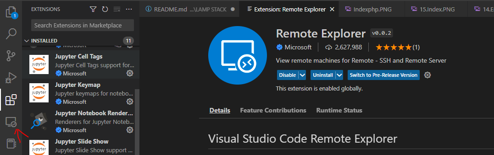

- In the remote explorer settings, add the config settings of your server to the ssh settings file


**Note** IdentityFile: is the absolute path of your keypair on your PC

- Refresh in remote explorer and your new server is now listed (to remove a server - delete the config info in ssh and refresh)

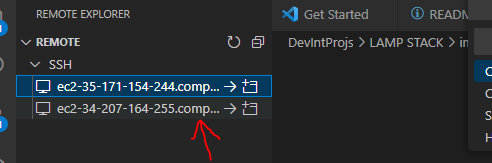

- click on connect by the side of the server to open the connection. click connect


- Remote connection is being established

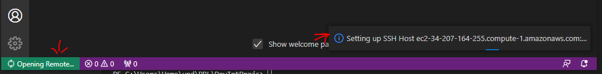

- Select OS and click on continue that appears immediately after


- Remote connection established 💪 :muscle:

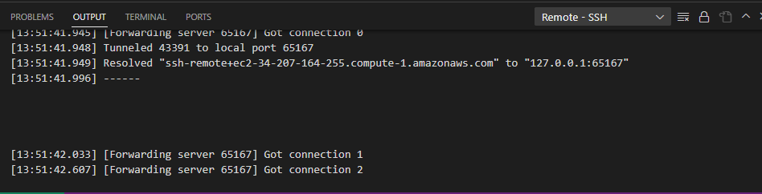

- Switch to terminal tab to run your commands :sunglasses:


**Warning** Ensure to close connection from file menu once done with the remote connection otherwise remote explorer will annoyingly attempt to re-establish connectiong everytime you launch VScode. Boy, that will upset you eventually, I promise.

### Install/Configure Apache
**Requirements**
1. Provisioned server
2. Account with sudo access

- To start, update the list of packages with the command

    `sudo apt update`

- Next, run the apache2 package installation

    `sudo apt install apache2`

- After completion, verify that the apache2 service is running

    `sudo systemctl status apache2 `


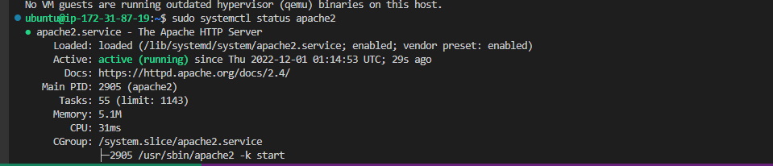

- if all goes well without error, the result will show a running apache service - We have launced our first Web Server in the cloud!! :sunglasses:

- Now that our server is is running we can access it locally and via the internet

- Run the following commands via bash and the browser

    ` curl http://localhost:80` and   `curl http://127.0.0.1:80`

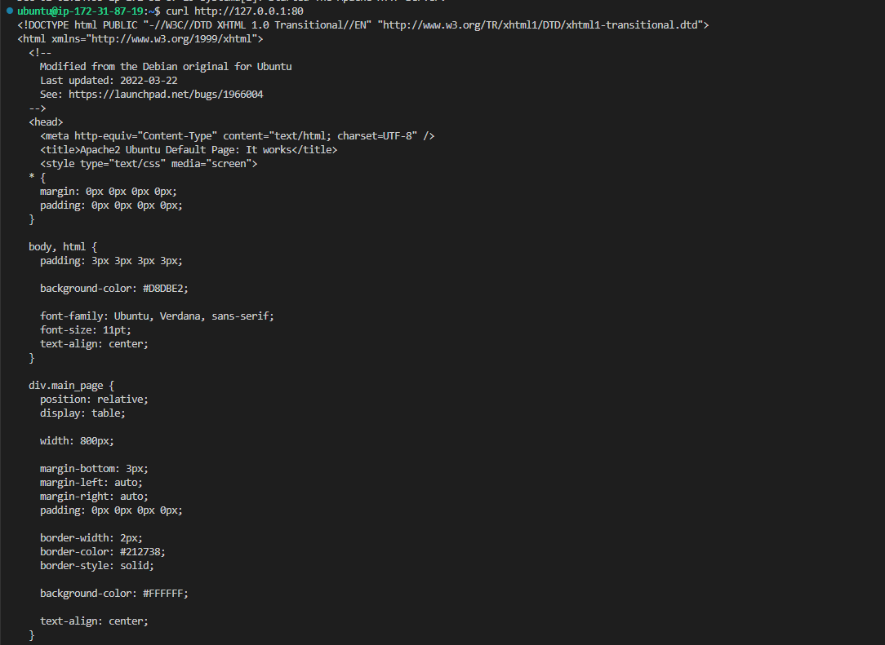

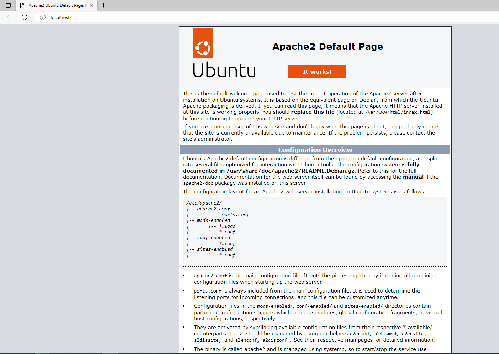


### Install/Configure MySQL
**Requirements**
1. Provisioned server
2. Account with sudo access

- To start, run this command in the terminal to install MySQl 

    `sudo apt install mysql-server`

- Accept the prompt to allow installation

- On completion, log in to MySQl console with the command

    `sudo mysql`

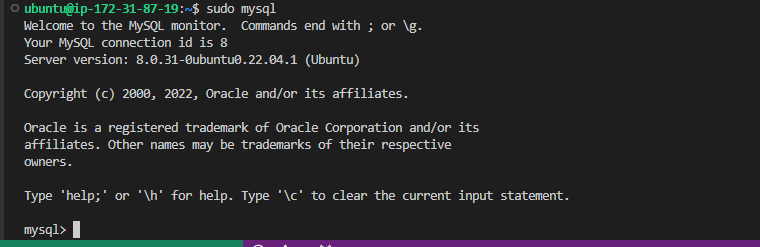

- Next, for added security, create password for root user using the command below
    
    ```
    ALTER USER 'root'@'localhost' IDENTIFIED WITH mysql_native_password BY <new-password>;
    ```

- Exit MySQL
   
    `exit`

- Run recommened security script to overwrite default security settings
    
    `sudo mysql_secure_installation`

The scripts prompts a couple of options that are either accepted or rejected to update security settings. In this excercise we rejected the first prompt to validate password, and all other prompts

- Afterwards, test that you can now access MySQL only providing just created password

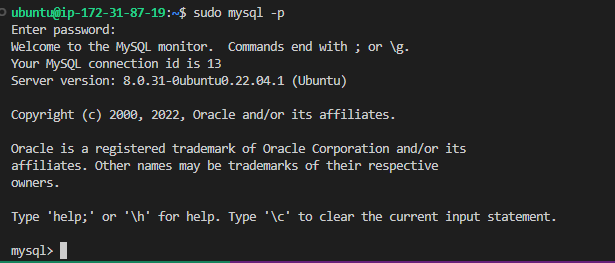


### Install/Configure PHP
**Requirements**
1. Provisioned server
2. Account with sudo access
3. Apache installed and configured

- To start, run this command in the terminal to install PHP

    ```sudo apt install php libapache2-mod-php php-mysql```

- Confirm php is successfully installed with this command 

    `php -v`

- Result looks like this

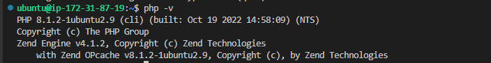


So far we have our LAMP stack successfully installed. Kudos to us! :thumbsup:

### Create Virtual host for website using Apache
**Requirements**
1. Provisioned server
2. Account with sudo access
3. Apache installed and configured

Next we put our stack to test by creating a virtual host for our website using Apache
We will set up a domain - projectlamp

- First we create a directory for projectlamp with this command

    `sudo mkdir /var/www/projectlamp`

- Next, assign ownership of the directory to the current user

    `sudo chown -R $USER:$USER /var/www/projectlamp`

- Next  create and open a new configuration file in Apache’s sites-available directory

    `sudo vi /etc/apache2/sites-available/projectlamp.conf`

- Paste the following block of bare bone configuration codes in the file and save

```
<VirtualHost *:80>
    ServerName projectlamp
    ServerAlias www.projectlamp 
    ServerAdmin webmaster@localhost
    DocumentRoot /var/www/projectlamp
    ErrorLog ${APACHE_LOG_DIR}/error.log
    CustomLog ${APACHE_LOG_DIR}/access.log combined
</VirtualHost>
```

- Check that the files are saved by listing the directory

    `sudo ls /etc/apache2/sites-available`

- if all goes well, you'll see something like.

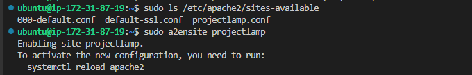

- System is requesting for Apache reload, so run the command like below

    `sudo systemctl reload apache2`

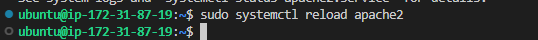

- To enable the new virtual host, usr a2ensite command

    `sudo a2ensite projectlamp`

- It is recommended to disable the default website that comes along with Apache installation otherwise our website may b overwritten by the default and be displayed instead. Disable default wbesite with the command below

    `sudo a2dissite 000-default`

- At this point, we'll to test that there are no syntas error in out file with this command

    `sudo apache2ctl configtest`

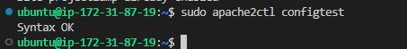

- Once again reload Apache to ensure all changes are applied

Our new website is now active but with an empty web root. 

- Create an index.html file in **/var/www/projectlamp** with the following content

```
sudo echo 'Hello LAMP from hostname' $(curl -s http://169.254.169.254/latest/meta-data/public-hostname) 'with public IP' $(curl -s http://169.254.169.254/latest/meta-data/public-ipv4) > /var/www/projectlamp/index.html
```
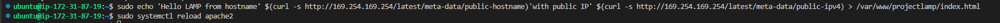

We can now check that our website is accessible. We run this check using IP address and DNS names

- If all goes well, both checks displays the same result and you see a welcome message along with your EC2 IP address and Domain name

    `http://<Public-IP-Address>:80`

    `http://<Public-DNS-Name>:80`

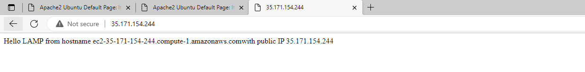

### Enable PHP on created website
**Requirements**
1. Provisioned server
2. Account with sudo access
3. Apache installed and configured
4. PHP installed and configured


While index.html is useful to test our webserver, it is mainly used to set up default landing page while maintenance is being carried out. There is need for a new file index.php which should represent the website and must be configured to overwrite index.html either by removing index.html or reordering the listing of the files in **/etc/apache2/mods-enabled/dir.conf**

- Change the order of the files, open the file

    `sudo vim /etc/apache2/mods-enabled/dir.conf`

- Within the block of code, change

*DirectoryIndex index.html index.cgi index.pl index.php index.xhtml index.htm*

to 

*DirectoryIndex index.php index.html index.cgi index.pl index.xhtml index.htm*

- save file

- Create a new file index.php inside the custom web root folder

    `vim /var/www/projectlamp/index.php`

- Paste the code below to display php info page

```
<?php
phpinfo();
```

- If all goes well to this point, you should see below 

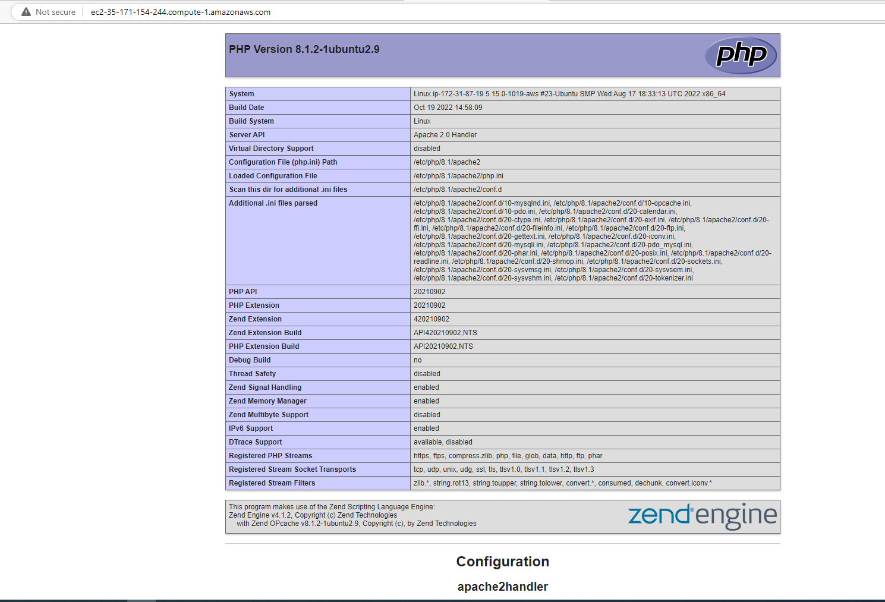

Voila! Our website is fully functional. :ok_hand:

For now we remove the php file since it contains sensitive info about our environment and server, we will be enhancing in the future

- remove index.php

    `sudo rm /var/www/projectlamp/index.php`


