# LEMP WEBSTACK IMPLEMETATION IN AWS
LEMP - stands for Linux, Nginx, MySQL, PHP/Python/Perl

Webstacks are a stack of technologies that make different solutions possible. In this implementation, we will be installing these technologies on a cloud server (AWS), and our P is PHP.


## Tasks to be completed
1. Provision Ubuntu Server on AWS
2. Remote login to server
3. Install/Configure Nginx
4. Install/Configure MySQL
5. Install/Configure PHP
6. Configure Nginx to use PHP Processort
7. Test PHP with Nginx
8. Retrieve data from MYSQL database with PHP


# Tasks Workthrough
## Provision Ubuntu Server on AWS
**Requirements**
1. AWS account. Sign up for free tier account [here](https://aws.amazon.com/) if you do not already have one
2. Ubuntu EC2 server
3. A keypair. You can use an existing one or create a new one
4. Remote connection via ssh (ubuntu), putty (windows). we'll be connecting with ssh via Vscode in this excercise but your ubuntu, wsl, windows etc will also suffice


- To start login to your AWS account, select EC2 on the navigation menu and under Instance select Launch Instances
- Fill the the installation details like Server name, select OS - we will be working with Ubuntu Server 22.04 LTS for this project


- Select or create a new key pair. This will later be used to establish remote access

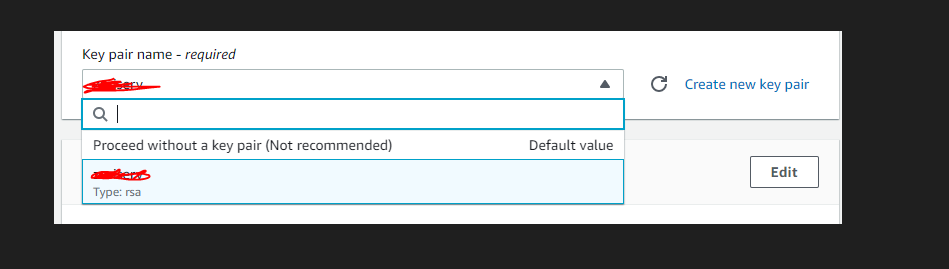

- For the purpose of this project, it will suffice to allow all other options use default values

- Click on Launch Instance to complete installation

- Voila! If all steps are followed correctly a new server just gpt provisioned. Go to EC2 dashboard to access new created server

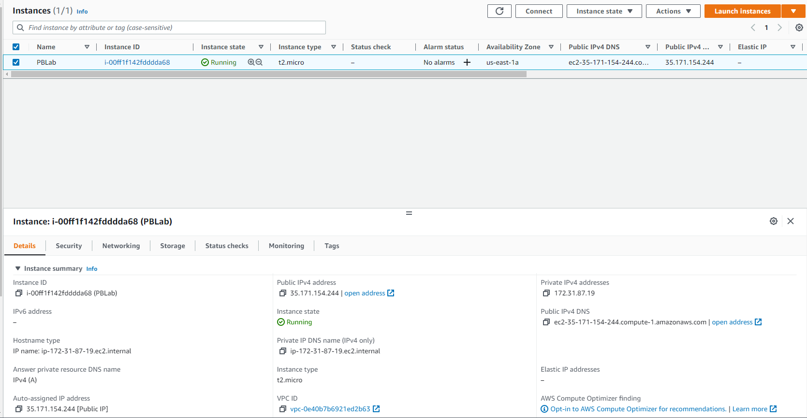

- One more step that can be taken here is open TCP port 80 to receive traffic. To do this go to security tab under the server, select the security group, then edit inbound rules and add http rule as show below and save

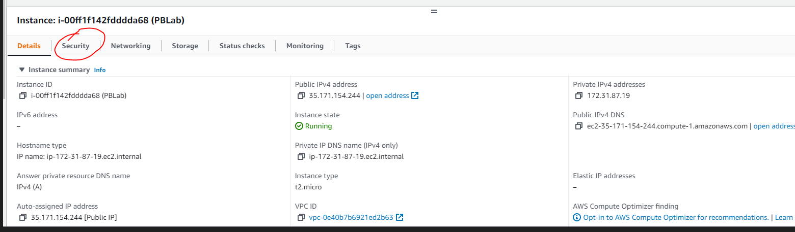

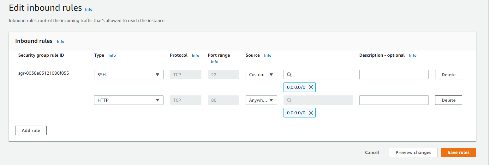


## Remote login to server
**Requirements**
1. Provisioned server
2. Account with sudo access
3. keypair

- If the keypair is newly created, the permission needs to be changed otherwise remote connection request will be denied

change permission for your keypair using this command

    sudo chmod 0400 <private-key-name>.pem

- For this project we are using an existing keypair whose permission has been previously changed so this step is skipped

- Next you want to connect to the server. There are several platforms for connection, most common is to ssh via Ubuntu bash from a PC. 
on windows it is most common to use putty to establish connection

- In this project we will be demonstrating how to use VScode to connect

- First ensure the vscode remote connection *remote explorer* extension is installed

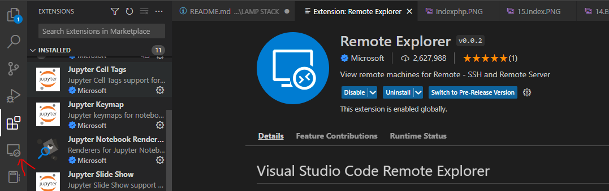

- In the remote explorer settings, add the config settings of your server to the ssh settings file

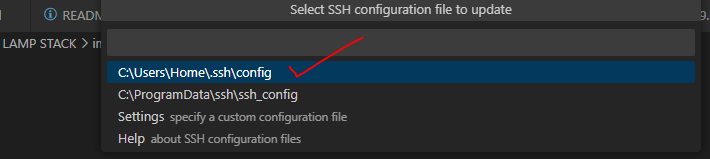

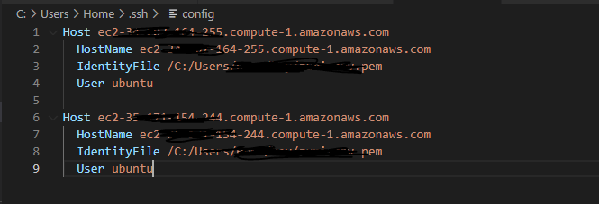

> **Note** IdentityFile: is the absolute path of your keypair on your PC

- Refresh in remote explorer and your new server is now listed (to remove a server - delete the config info in ssh and refresh)

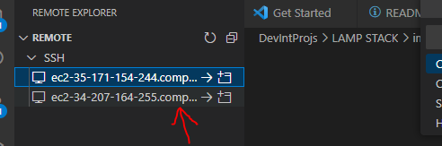

- click on connect by the side of the server to open the connection. click connect

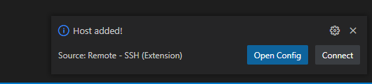

- Remote connection is being established

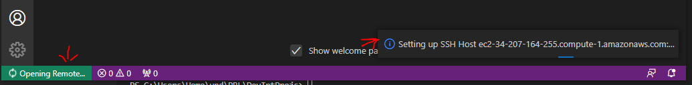

- Select OS and click on continue that appears immediately after

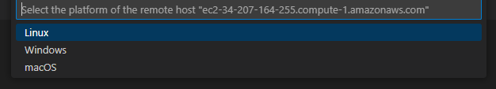

- Remote connection established :muscle:

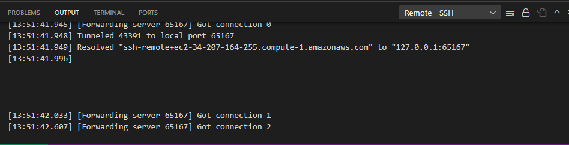

- Switch to terminal tab to run your commands :sunglasses:

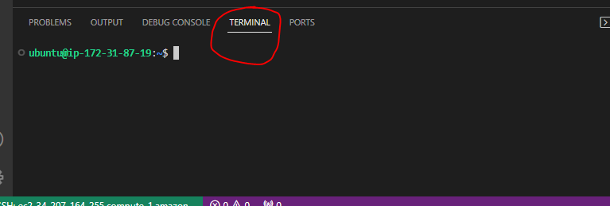

> **Warning** Ensure to close connection from file menu once done with the remote connection otherwise remote explorer will annoyingly attempt to re-establish connectiong everytime you launch VScode. Boy, that will upset you eventually, I promise.

## Install/Configure Nginx
**Requirements**
1. Provisioned server
2. Account with sudo access

- To start, update the list of packages with the command

    `sudo apt update`

- Next, run the nginx package installation

    `sudo apt install nginx`

- After completion, verify that the nginx service is running

    `sudo systemctl status nginx `


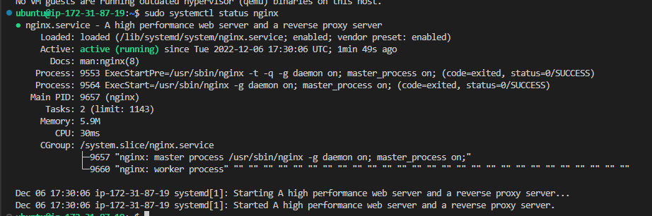

- if all goes well without error, the result will show a running anginx service - We have launced our first Web Server in the cloud!! :sunglasses:

- Now that our server is is running we can access it locally and via the internet

- Run the following commands via bash and the browser

    ` curl http://localhost:80` and   `curl http://127.0.0.1:80`

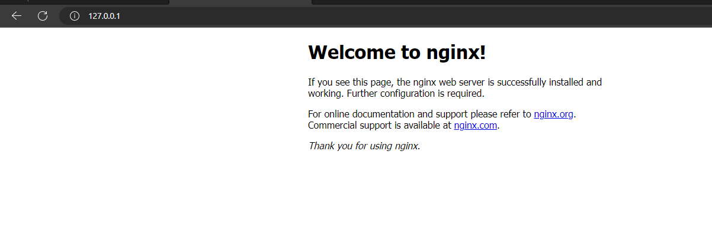

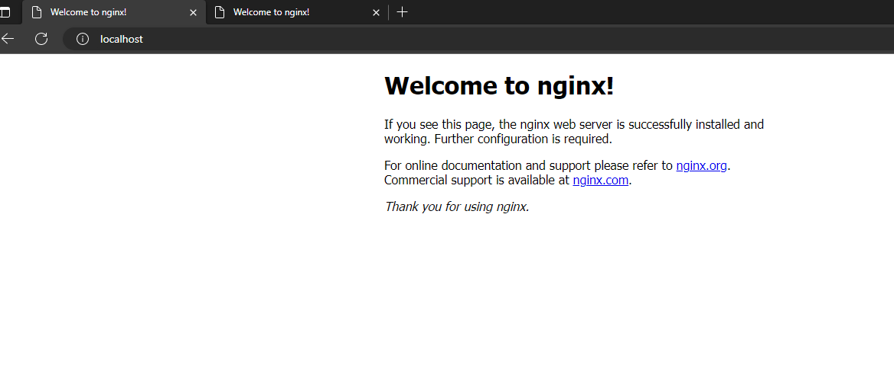


## Install/Configure MySQL
**Requirements**
1. Provisioned server
2. Account with sudo access

- To start, run this command in the terminal to install MySQl 

    `sudo apt install mysql-server`

- Accept the prompt to allow installation

- On completion, log in to MySQl console with the command

    `sudo mysql`

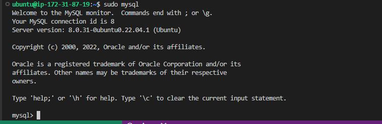

- Next, for added security, create password for root user using the command below
    
    ```
    ALTER USER 'root'@'localhost' IDENTIFIED WITH mysql_native_password BY <new-password>;
    ```

- Exit MySQL
   
    `exit`

- Run recommened security script to overwrite default security settings
    
    `sudo mysql_secure_installation`

The scripts prompts a couple of options that are either accepted or rejected to update security settings. In this excercise we rejected the first prompt to validate password, and accepted all other prompts

- Afterwards, test that you can now access MySQL only with password

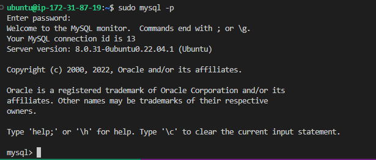


## Install/Configure PHP
**Requirements**
1. Provisioned server
2. Account with sudo access
3. Nginx installed and configured

- To start, run this command in the terminal to install PHP

    `sudo apt install php-fpm php-mysql`

- Confirm php is successfully installed with this command 

    `php -v`

- Result looks like this

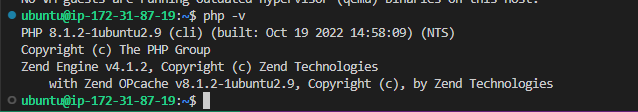


So far we have our LEMP stack successfully installed. Kudos to us! :thumbsup:

## Configure Nginx to use PHP Processor
**Requirements**
1. Provisioned server
2. Account with sudo access
3. Nginx installed and configured
4. PHP installed

- First we create a directory for projectlemp with this command

    `sudo mkdir /var/www/projectLEMP`

- Next, assign ownership of the directory to the current user

    `sudo chown -R $USER:$USER /var/www/projectLEMP`

- Next  open a new configuration file in Nginx sites-available directory 

    `sudo vi /etc/nginx/sites-available/projectLEMP`

- Paste the following block of bare bone configuration codes in the file and save

```
#/etc/nginx/sites-available/projectLEMP
server {
	listen 80;
	server_name projectLEMP www.projectLEMP;
	root /var/www/projectLEMP;

	index index.html index.htm index.php;
	
	location / {
	try_files $uri $uri/ =404;
	}

	location ~ \.php$ {
	include snippets/fastcgi-php.conf;
	fastcgi_pass unix:/var/run/php/php8.1-fpm.sock;
	}
	
	location ~ /\.ht {
	deny all;
	}
}
```
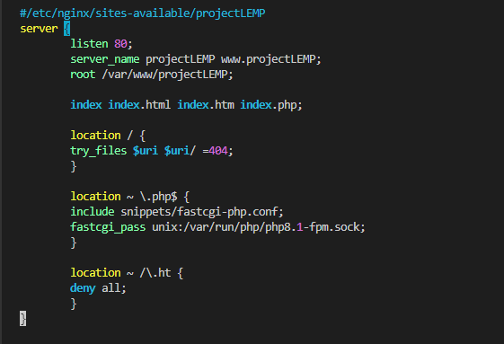

- Activate your configuration by linking to the config file from Nginx’s sites-enabled directory:

    `sudo ln -s /etc/nginx/sites-available/projectLEMP /etc/nginx/sites-enabled/`

- Test your configuration 

    `sudo nginx -t`

Result is as shown below

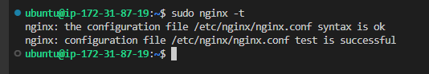


- Also, you need to disable default Nginx host that is currently configured to listen on port 80 with the code below

    `sudo unlink /etc/nginx/sites-enabled/default`

- Ensure to reload Nginx to apply all changes
    
    `sudo systemctl reload nginx`

- Website is now active but the web root is still empty. To correct this  create a simple index.html in the root. This will be used to test that the server block works as expected

    ```
    sudo echo 'Hello LEMP from hostname' $(curl -s
    http://169.254.169.254/latest/meta-data/public-hostname) 'with public IP' $(curl -s
    http://169.254.169.254/latest/meta-data/public-ipv4) > /var/www/projectLEMP/index.html
    ```

We can now check that our website is accessible. We run this check using IP address and DNS names

- If all goes well, both checks displays the same result and you see a welcome message along with your EC2 IP address and Domain name

    `http://<Public-IP-Address>:80`

    `http://<Public-DNS-Name>:80`

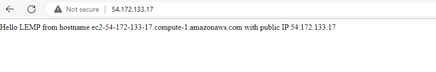
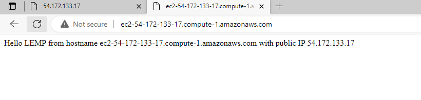

Your LEMP stack is now fully configured! :thumbsup:


## Test PHP with Nginx
**Requirements**
1. Provisioned server
2. Account with sudo access
3. Nginx installed and configured
4. PHP installed and configured

- Test to validate that Nginx can correctly hand .php files off to your PHP processor

- Create a test PHP file info.php inside the custom web root folder

    `vim /var/www/projectLEMP/info.php`

- Paste the code below to display php info page

    ```
    <?php
    phpinfo();
    ```
- Now access this from your web browser using

    `http://`server_domain_or_IP`/info.php`

- If all goes well to this point, you should see below 

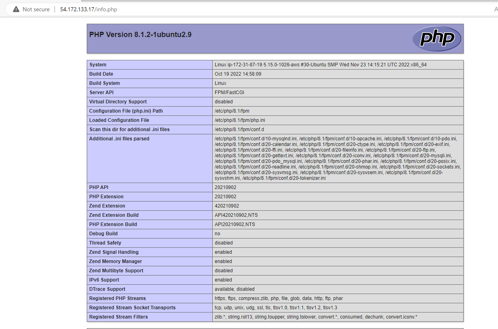
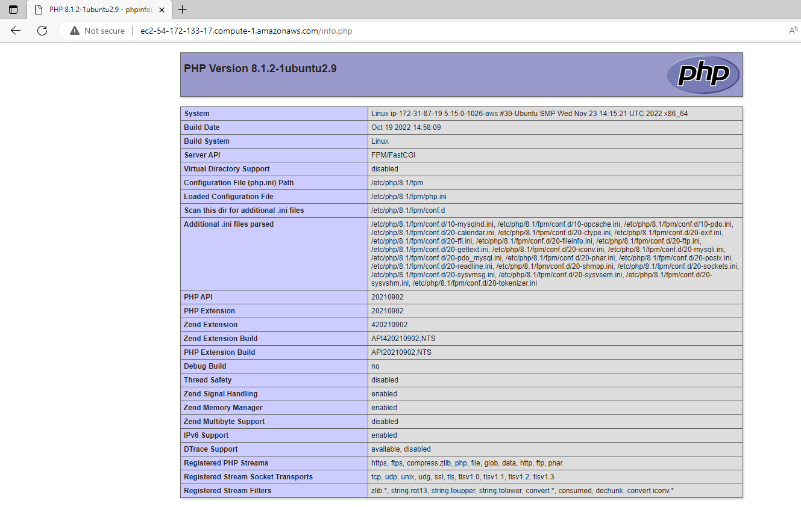


Voila! Our website is fully functional. :ok_hand:

For now we remove the php file since it contains sensitive info about our environment and server, we will be enhancing in the future

- remove index.php

    `sudo rm /var/www/projectLEMP/info.php`


## Retrieve data from MySQL database with PHP
**Requirements**
1. Provisioned server
2. Account with sudo access
3. Nginx installed and configured
4. PHP installed and configured
5. Mysql installed and configured

- First reconnect to mysql database using credentials you created in the previous step

- Next, create a new database following command below
    
    `CREATE DATABASE example_database;`

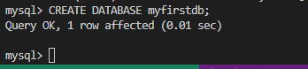

Next, create a new user and grant it full priviledges on the newly created database

- To create user, follow the command below

    `CREATE USER 'example_user'@'%' IDENTIFIED WITH mysql_native_password BY 'password';`

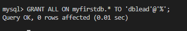

- To grant full access, follow the command below

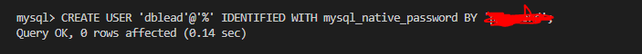

Now exit MySQL shell with
    
   `exit`

- Test if the new user has the proper permissions by logging in to the MySQL console
again, this time using the custom user credentials

    `mysql -u example_user -p`

> **Note** replace 'example_user' with the new username, and provide password when prompted

- List all databases in mysql
    
    `SHOW DATABASES;`

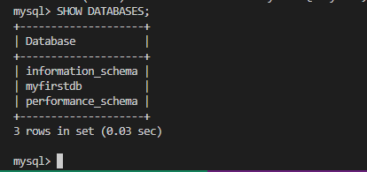

- Here we want to create a table named todo_list in the new database.  The command is 

    `CREATE TABLE myfirstdb.todo_list (item_id INT AUTO_INCREMENT, content VARCHAR(255), PRIMARY KEY(item_id));`

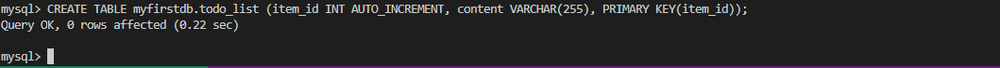

- Next is to insert some data into the database. Make it a few  more rows to make your test queries richer. 

    `INSERT INTO myfirstdb.todo_list (content) VALUES ("My first important item");`
    `INSERT INTO myfirstdb.todo_list (content) VALUES ("Yet another important item");`
    `INSERT INTO myfirstdb.todo_list (content) VALUES ("Not as important but relevant item");`
    `INSERT INTO myfirstdb.todo_list (content) VALUES ("I'm only here for the vibes item");`
    `INSERT INTO myfirstdb.todo_list (content) VALUES ("I don't even want to be here item");`

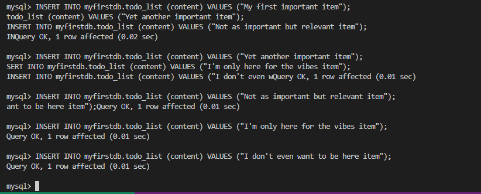

Also try to be a tad more creative than me here 

- Ok, next is to query the database to ensure all data were successfully saved

    `SELECT * FROM example_database.todo_list;`

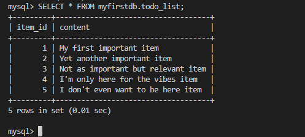

Yep! All looks as good as expected :sunglasses:

- Exit sql 

    `exit`

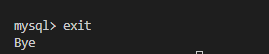

- Now to the bone of this excercise, we are going to create a PHP script that enable us query our new MySQL database from the browser

- Firstly, create a new php filr in your custom web root 
    
    `sudo vi /var/www/projectLEMP/todo_list.php`

- Copy the connect below to your php file. This script connects to the database using the credentials provided.

    ```
    <?php
    $user = "dblead";
    $password = user-password;
    $database = "myfirstdb";
    $table = "todo_list";
    try {
        $db = new PDO("mysql:host=localhost;dbname=$database", $user, $password);
        echo "<h2>TODO</h2><ol>";
        foreach($db->query("SELECT content FROM $table") as $row) {
            echo "<li>" . $row['content'] . "</li>";
    }
    echo "</ol>";
    } catch (PDOException $e) {
        print "Error!: " . $e->getMessage() . "<br/>";
        die();
    }
    ```

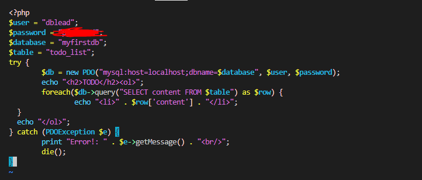 

- Now access this page from your web browser using
    
    `http://<Public_domain_or_IP>/todo_list.php`

- If all as gone well so far, a table of the query result is returned

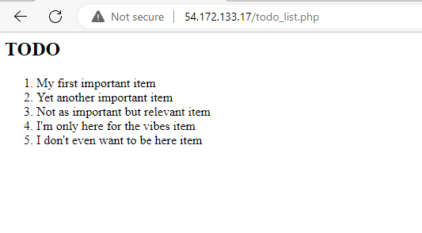
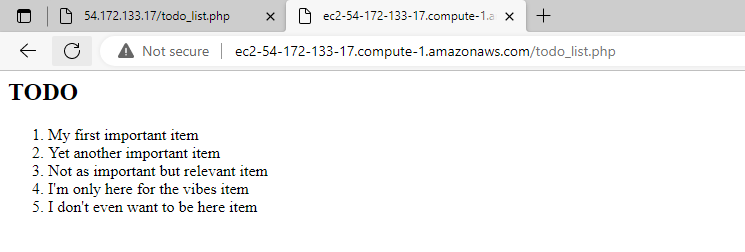

- If you got this, then WOW! Congratulations!:congratulations: You did it. This means your PHP environment is ready to connect and interact with your MySQL server. :clap:

- If you didn't get this then please trace your steps back through the instructions. Goodluck:exclamation::exclamation:


